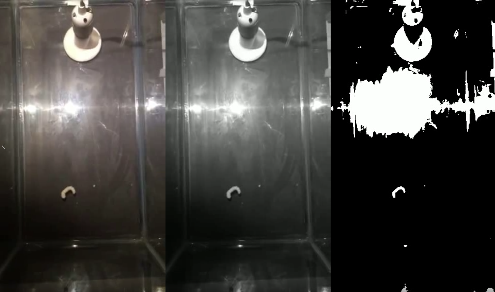

# Python 3 Wrappers for Video and CSV Readers/Writers
- A simple set of wrappers for Python's built-in CSV package and OpenCV 3's Video Reader/Writer classes.
- Annotated code for Python3 beginners to read through and understand
- Includes an examples.py file and sample video to see the code in action

### Instructions
1. Clone to disk
2. Ensure Python 3.5+, Numpy, and OpenCV 3.3+ are installed
2. Run `python examples.py` and examine outputs
3. Read through code and comments

